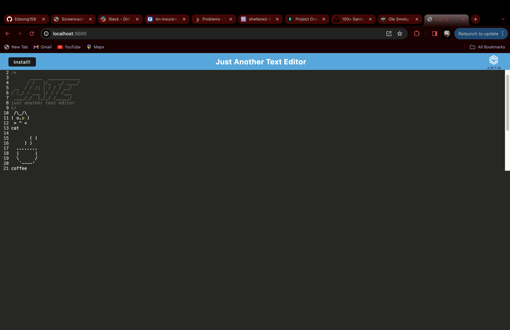

# Browser Text Editor

This is a browser-based text editor application that allows users to create, edit, and save text documents directly within their web browser. The application is built as a single-page application (SPA) and meets the criteria for a Progressive Web App (PWA). It features offline functionality and utilizes data persistence techniques for redundancy.

## Installation

1. Clone the repository:
2. Navigateto the project directory cd Web-Text-Editor
3. Run: npm install
4. Start the server: npm start
5. Open server on Localhost:3000

## Usage

Once in the serve you can start type all of your notes, you can save and delete notes in here.

## Screenshot

